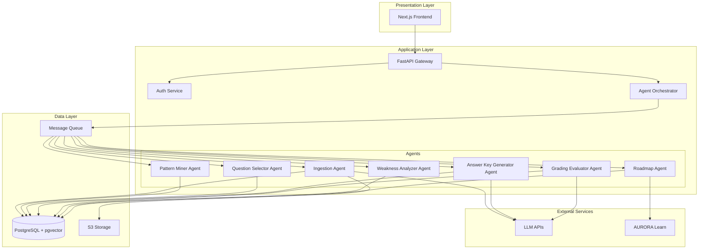

# Design Document: AURORA Assess

## Overview

AURORA Assess is a multi-agent orchestration system that provides intelligent exam generation, automated evaluation, and personalized learning recommendations. The system architecture follows a microservices pattern with specialized agents coordinating through event-driven communication.

The system consists of three main layers:
1. **Presentation Layer**: Next.js 14 frontend with TypeScript, Tailwind CSS, and shadcn/ui components
2. **Application Layer**: FastAPI backend services with agent orchestration
3. **Data Layer**: PostgreSQL with pgvector for relational data and semantic search

Key design principles:
- Agent-based architecture for modularity and scalability
- Event-driven communication for loose coupling
- Knowledge graph for intelligent recommendations
- Hybrid evaluation combining rule-based and LLM-powered grading
- Asynchronous processing for long-running tasks

## Architecture

### System Architecture Diagram



### Component Responsibilities

**Frontend (Next.js 14)**
- User authentication and session management
- Question bank and resource upload interfaces
- Exam configuration and generation UI
- Exam attempt and submission interface
- Performance dashboard and analytics visualization
- Faculty grading review and override interface

**API Gateway (FastAPI)**
- Request routing and validation
- Authentication and authorization middleware
- Rate limiting and request throttling
- Response formatting and error handling
- WebSocket support for real-time updates

**Agent Orchestrator**
- Agent lifecycle management
- Task queue management
- Event publishing and subscription
- Retry logic and error recovery
- Agent monitoring and health checks

**Agents** (detailed in Components section)

**Database (PostgreSQL + pgvector)**
- Relational data storage
- Vector embeddings for semantic search
- Knowledge graph representation
- Transaction management

**Message Queue (Redis/RabbitMQ)**
- Asynchronous task distribution
- Event-driven communication
- Task persistence and reliability

**S3 Storage**
- File storage for question banks and resources
- Versioning and lifecycle management
- Pre-signed URL generation

## Components and Interfaces

### 1. Ingestion & Tagging Agent

**Purpose**: Parse uploaded files, extract questions, and suggest tags using LLM analysis.

**Inputs**:
- File ID and storage path
- Subject ID
- Faculty ID

**Processing**:
1. Retrieve file from S3 storage
2. Parse file based on format (PDF/DOCX/TXT)
3. Extract individual questions using pattern matching and LLM
4. For each question, use LLM to suggest: unit, topic, marks, type, difficulty
5. Store questions with suggested tags in database
6. Generate embeddings for semantic search

**Outputs**:
- List of extracted questions with suggested tags
- Parsing errors and warnings
- Success/failure status

**LLM Prompt Structure**:
```
You are analyzing an exam question to extract metadata.

Question: {question_text}

Extract the following information:
1. Marks: Estimated marks for this question (1, 2, 3, 5, 10, or 12)
2. Type: MCQ, Short Answer, Long Answer, Numerical, or True/False
3. Difficulty: Easy, Medium, or Hard
4. Topic: Main topic covered (be specific)
5. Unit: Broader unit or chapter

Respond in JSON format:
{
  "marks": <number>,
  "type": "<type>",
  "difficulty": "<difficulty>",
  "topic": "<topic>",
  "unit": "<unit>"
}
```

**Interface**:
```python
class IngestionAgent:
    async def process_file(
        self, 
        file_id: str, 
        subject_id: str, 
        faculty_id: str
    ) -> IngestionResult:
        pass
    
    async def suggest_tags(
        self, 
        question_text: str
    ) -> QuestionTags:
        pass
```

### 2. Pattern Miner Agent

**Purpose**: Analyze question banks to learn exam patterns and distributions.

**Inputs**:
- Subject ID
- List of question bank IDs

**Processing**:
1. Retrieve all questions for the subject
2. Calculate mark distribution: count of questions per mark value
3. Calculate type distribution: percentage of each question type
4. Calculate topic coverage: frequency of each topic
5. Calculate difficulty distribution per mark category
6. Aggregate patterns across multiple banks
7. Store learned pattern as JSON

**Outputs**:
- Pattern object with distributions
- Pattern confidence score
- Pattern visualization data

**Pattern Structure**:
```json
{
  "subject_id": "uuid",
  "mark_distribution": {
    "1": 0.15,
    "2": 0.20,
    "3": 0.25,
    "5": 0.20,
    "10": 0.15,
    "12": 0.05
  },
  "type_distribution": {
    "MCQ": 0.30,
    "Short Answer": 0.40,
    "Long Answer": 0.20,
    "Numerical": 0.10
  },
  "topic_weights": {
    "topic_1": 0.25,
    "topic_2": 0.30,
    "topic_3": 0.45
  },
  "difficulty_by_marks": {
    "1": {"Easy": 0.7, "Medium": 0.3},
    "2": {"Easy": 0.5, "Medium": 0.4, "Hard": 0.1},
    "5": {"Medium": 0.6, "Hard": 0.4}
  }
}
```

**Interface**:
```python
class PatternMinerAgent:
    async def learn_patterns(
        self, 
        subject_id: str, 
        bank_ids: List[str]
    ) -> Pattern:
        pass
    
    async def update_pattern(
        self, 
        pattern_id: str, 
        new_bank_id: str
    ) -> Pattern:
        pass
```

### 3. Question Selector Agent

**Purpose**: Select questions for paper generation based on constraints and learned patterns.

**Inputs**:
- Subject ID
- Constraints: total marks, mark distribution, type distribution, topic coverage, difficulty mix
- Number of sets to generate
- Learned pattern

**Processing**:
1. Validate constraints against available questions
2. For each set:
   - Initialize empty paper
   - For each mark category, select questions matching type and difficulty constraints
   - Apply pattern-based weighting for topic selection
   - Ensure minimal overlap with previous sets
   - Use knowledge graph to ensure concept coverage
3. Verify each set satisfies all constraints
4. Return selected question IDs for each set

**Outputs**:
- List of paper sets (each set is a list of question IDs)
- Constraint satisfaction report
- Diversity score across sets

**Selection Algorithm**:
```
1. Build candidate pool: filter questions by subject, marks, type, difficulty
2. For each mark category:
   a. Calculate required count from constraints
   b. Apply topic weights from pattern
   c. Score each candidate: pattern_match * (1 - overlap_penalty) * kg_coverage
   d. Select top N questions
3. Validate total marks and constraint satisfaction
4. If invalid, backtrack and retry with adjusted scoring
```

**Interface**:
```python
class QuestionSelectorAgent:
    async def generate_papers(
        self,
        subject_id: str,
        constraints: PaperConstraints,
        num_sets: int,
        pattern: Pattern
    ) -> List[PaperSet]:
        pass
    
    async def validate_constraints(
        self,
        subject_id: str,
        constraints: PaperConstraints
    ) -> ValidationResult:
        pass
```

### 4. Answer Key Generator Agent

**Purpose**: Generate model answers and grading rubrics for questions.

**Inputs**:
- Question ID
- Question text and type
- Linked resources

**Processing**:
1. For MCQ/True-False: Use stored correct answer
2. For Short/Long Answer:
   - Retrieve linked resources
   - Extract relevant excerpts using semantic search
   - Use LLM to generate model answer grounded in resources
   - Generate grading rubric with point allocation
3. Store answer key with rubric

**Outputs**:
- Model answer text
- Grading rubric (JSON structure)
- Resource citations

**LLM Prompt Structure**:
```
You are generating a model answer for an exam question.

Question: {question_text}
Marks: {marks}
Type: {type}

Relevant Resources:
{resource_excerpts}

Generate:
1. A comprehensive model answer (grounded in the provided resources)
2. A grading rubric breaking down point allocation

Format your response as JSON:
{
  "model_answer": "<detailed answer>",
  "rubric": {
    "criteria": [
      {"description": "<criterion>", "points": <number>},
      ...
    ]
  },
  "citations": ["<resource_id>", ...]
}
```

**Interface**:
```python
class AnswerKeyGeneratorAgent:
    async def generate_answer_key(
        self,
        question_id: str,
        resources: List[Resource]
    ) -> AnswerKey:
        pass
    
    async def generate_rubric(
        self,
        question_text: str,
        marks: int
    ) -> GradingRubric:
        pass
```

### 5. Grading Evaluator Agent

**Purpose**: Evaluate student answers and assign scores with feedback.

**Inputs**:
- Attempt ID
- Student answers
- Answer keys with rubrics

**Processing**:
1. For each question:
   - If MCQ/True-False: exact match comparison
   - If Short/Long Answer:
     - Use LLM to compare student answer with model answer
     - Apply rubric criteria
     - Assign partial credit based on rubric
     - Generate feedback explaining score
2. Calculate total score
3. Store evaluation results

**Outputs**:
- Per-question scores
- Per-question feedback
- Total score
- Evaluation metadata (timestamp, confidence)

**LLM Prompt Structure**:
```
You are grading a student's answer to an exam question.

Question: {question_text}
Marks: {marks}

Model Answer:
{model_answer}

Grading Rubric:
{rubric_json}

Student Answer:
{student_answer}

Evaluate the student's answer against the rubric. For each criterion:
1. Determine if the student met the criterion (fully, partially, or not at all)
2. Assign points accordingly
3. Provide specific feedback

Respond in JSON format:
{
  "criterion_scores": [
    {
      "criterion": "<description>",
      "max_points": <number>,
      "awarded_points": <number>,
      "feedback": "<specific feedback>"
    },
    ...
  ],
  "total_score": <number>,
  "overall_feedback": "<summary feedback>"
}
```

**Interface**:
```python
class GradingEvaluatorAgent:
    async def evaluate_attempt(
        self,
        attempt_id: str,
        answers: List[StudentAnswer],
        answer_keys: List[AnswerKey]
    ) -> Evaluation:
        pass
    
    async def grade_single_answer(
        self,
        student_answer: str,
        answer_key: AnswerKey
    ) -> QuestionEvaluation:
        pass
```

### 6. Weakness Analyzer Agent

**Purpose**: Analyze student performance to identify knowledge gaps and weaknesses.

**Inputs**:
- Student ID
- Evaluation results
- Knowledge graph

**Processing**:
1. Aggregate scores by topic across all attempts
2. Calculate topic-wise performance percentages
3. Identify topics with score < 60% as weaknesses
4. Use knowledge graph to map topics to concepts
5. Calculate concept mastery scores
6. Rank weaknesses by severity (score gap * concept importance)
7. Find related strong concepts (prerequisites)
8. Recommend resources for each weakness

**Outputs**:
- List of weak topics with severity scores
- List of weak concepts with mastery levels
- Recommended resources per weakness
- Performance trends over time

**Analysis Algorithm**:
```
1. For each topic:
   topic_score = sum(question_scores) / sum(question_max_scores)
   
2. Identify weaknesses:
   weaknesses = [topic for topic in topics if topic_score < 0.6]
   
3. Map to concepts using knowledge graph:
   weak_concepts = KG.get_concepts_for_topics(weaknesses)
   
4. Calculate severity:
   severity = (0.6 - topic_score) * concept_importance
   
5. Find prerequisites:
   for concept in weak_concepts:
     prereqs = KG.get_prerequisites(concept)
     strong_prereqs = [p for p in prereqs if mastery[p] > 0.7]
```

**Interface**:
```python
class WeaknessAnalyzerAgent:
    async def analyze_performance(
        self,
        student_id: str,
        evaluation_id: str
    ) -> PerformanceAnalysis:
        pass
    
    async def identify_weaknesses(
        self,
        student_id: str,
        subject_id: str
    ) -> List[Weakness]:
        pass
```

### 7. Roadmap Agent

**Purpose**: Interface with AURORA Learn to update personalized learning roadmaps.

**Inputs**:
- Student ID
- Weaknesses with severity
- Recommended resources

**Processing**:
1. Format weakness data for AURORA Learn API
2. Send POST request to AURORA Learn roadmap endpoint
3. Receive updated roadmap tasks
4. Store roadmap tasks in local database
5. Update concept mastery based on task completion

**Outputs**:
- Roadmap update status
- Updated roadmap tasks
- Sync timestamp

**API Payload Structure**:
```json
{
  "student_id": "uuid",
  "weaknesses": [
    {
      "concept_id": "uuid",
      "mastery_score": 0.35,
      "severity": 0.8,
      "recommended_resources": ["resource_id_1", "resource_id_2"]
    }
  ],
  "timestamp": "2024-01-15T10:30:00Z"
}
```

**Interface**:
```python
class RoadmapAgent:
    async def update_roadmap(
        self,
        student_id: str,
        weaknesses: List[Weakness]
    ) -> RoadmapUpdateResult:
        pass
    
    async def receive_roadmap_tasks(
        self,
        student_id: str,
        tasks: List[RoadmapTask]
    ) -> None:
        pass
    
    async def mark_task_complete(
        self,
        task_id: str,
        student_id: str
    ) -> None:
        pass
```

## Data Models

### Core Entities

```typescript
// User Management
interface User {
  id: string;
  email: string;
  password_hash: string;
  role: 'Student' | 'Faculty' | 'Admin';
  created_at: Date;
  updated_at: Date;
}

// Academic Structure
interface Subject {
  id: string;
  name: string;
  code: string;
  description: string;
}

interface Unit {
  id: string;
  subject_id: string;
  name: string;
  order: number;
}

interface Topic {
  id: string;
  unit_id: string;
  name: string;
  description: string;
}

interface Concept {
  id: string;
  topic_id: string;
  name: string;
  description: string;
  importance: number; // 0-1 scale
}

// Question Bank
interface QuestionBank {
  id: string;
  subject_id: string;
  faculty_id: string;
  file_path: string;
  file_name: string;
  file_size: number;
  upload_date: Date;
  status: 'Uploaded' | 'Processing' | 'Completed' | 'Failed';
}

interface Question {
  id: string;
  bank_id: string;
  text: string;
  marks: number;
  type: 'MCQ' | 'Short Answer' | 'Long Answer' | 'Numerical' | 'True/False';
  difficulty: 'Easy' | 'Medium' | 'Hard';
  unit_id: string;
  topic_id: string;
  correct_answer?: string; // For MCQ/True-False
  embedding: number[]; // Vector for semantic search
  tags_confirmed: boolean;
}

// Resources
interface Resource {
  id: string;
  subject_id: string;
  faculty_id: string;
  title: string;
  file_path: string;
  file_type: string;
  upload_date: Date;
  embedding: number[];
}

interface ResourceTopicLink {
  resource_id: string;
  topic_id: string;
}

interface QuestionResourceLink {
  question_id: string;
  resource_id: string;
  relevance_score: number;
}

// Patterns
interface Pattern {
  id: string;
  subject_id: string;
  mark_distribution: Record<number, number>;
  type_distribution: Record<string, number>;
  topic_weights: Record<string, number>;
  difficulty_by_marks: Record<number, Record<string, number>>;
  confidence: number;
  created_at: Date;
  updated_at: Date;
}

// Papers
interface Paper {
  id: string;
  subject_id: string;
  faculty_id: string;
  title: string;
  total_marks: number;
  generation_date: Date;
  constraints: PaperConstraints;
}

interface PaperConstraints {
  total_marks: number;
  mark_distribution: Record<number, number>; // marks -> count
  type_distribution: Record<string, number>; // type -> count
  topic_coverage: Record<string, number>; // topic_id -> min_questions
  difficulty_mix: Record<string, number>; // difficulty -> percentage
}

interface PaperQuestion {
  paper_id: string;
  question_id: string;
  order: number;
}

// Answer Keys
interface AnswerKey {
  id: string;
  question_id: string;
  model_answer: string;
  rubric: GradingRubric;
  resource_citations: string[];
  created_at: Date;
  reviewed_by_faculty: boolean;
}

interface GradingRubric {
  criteria: RubricCriterion[];
}

interface RubricCriterion {
  description: string;
  points: number;
}

// Attempts and Evaluations
interface Attempt {
  id: string;
  student_id: string;
  paper_id: string;
  start_time: Date;
  submit_time?: Date;
  status: 'In Progress' | 'Submitted' | 'Evaluated';
}

interface StudentAnswer {
  id: string;
  attempt_id: string;
  question_id: string;
  answer_text: string;
  submitted_at: Date;
}

interface Evaluation {
  id: string;
  attempt_id: string;
  total_score: number;
  max_score: number;
  evaluated_at: Date;
  evaluated_by: 'System' | 'Faculty';
}

interface QuestionEvaluation {
  id: string;
  evaluation_id: string;
  question_id: string;
  awarded_score: number;
  max_score: number;
  feedback: string;
  criterion_scores: CriterionScore[];
  overridden: boolean;
  overridden_by?: string;
}

interface CriterionScore {
  criterion: string;
  max_points: number;
  awarded_points: number;
  feedback: string;
}

// Performance Analysis
interface TopicPerformance {
  student_id: string;
  topic_id: string;
  total_score: number;
  max_score: number;
  percentage: number;
  attempt_count: number;
  last_attempt: Date;
}

interface Weakness {
  student_id: string;
  topic_id: string;
  concept_id: string;
  severity: number;
  mastery_score: number;
  recommended_resources: string[];
}

interface ConceptMastery {
  student_id: string;
  concept_id: string;
  mastery_level: number; // 0-1 scale
  last_updated: Date;
}

// Knowledge Graph
interface ConceptPrerequisite {
  concept_id: string;
  prerequisite_id: string;
  strength: number; // 0-1 scale
}

// Roadmap Integration
interface RoadmapUpdate {
  id: string;
  student_id: string;
  weaknesses: Weakness[];
  sent_at: Date;
  acknowledged: boolean;
}

interface RoadmapTask {
  id: string;
  student_id: string;
  concept_id: string;
  title: string;
  description: string;
  resources: string[];
  due_date?: Date;
  completed: boolean;
}

// Agent Tasks
interface AgentTask {
  id: string;
  agent_type: string;
  status: 'Queued' | 'Processing' | 'Completed' | 'Failed';
  input_data: any;
  output_data?: any;
  error_message?: string;
  created_at: Date;
  started_at?: Date;
  completed_at?: Date;
  retry_count: number;
}
```

### Knowledge Graph Structure

The knowledge graph is represented using relational tables with the following structure:

**Nodes**:
- Subject, Unit, Topic, Concept (academic hierarchy)
- Question (linked to topics)
- Resource (linked to topics)
- Student (for mastery tracking)

**Edges**:
- Unit → Subject (belongs_to)
- Topic → Unit (belongs_to)
- Concept → Topic (belongs_to)
- Concept → Concept (prerequisite)
- Question → Topic (covers)
- Question → Resource (references)
- Resource → Topic (explains)
- Student → Concept (mastery_level)

**Key Queries**:

1. Find all questions covering a concept:
```sql
SELECT q.* FROM questions q
JOIN topics t ON q.topic_id = t.id
JOIN concepts c ON c.topic_id = t.id
WHERE c.id = ?
```

2. Find prerequisites for a concept:
```sql
SELECT c2.* FROM concepts c1
JOIN concept_prerequisites cp ON c1.id = cp.concept_id
JOIN concepts c2 ON cp.prerequisite_id = c2.id
WHERE c1.id = ?
ORDER BY cp.strength DESC
```

3. Find weak concepts with strong prerequisites:
```sql
SELECT c.*, cm.mastery_level,
       (SELECT AVG(cm2.mastery_level) 
        FROM concept_prerequisites cp
        JOIN concept_mastery cm2 ON cp.prerequisite_id = cm2.concept_id
        WHERE cp.concept_id = c.id AND cm2.student_id = ?) as avg_prereq_mastery
FROM concepts c
JOIN concept_mastery cm ON c.id = cm.concept_id
WHERE cm.student_id = ? AND cm.mastery_level < 0.6
HAVING avg_prereq_mastery > 0.7
```

## Correctness Properties

