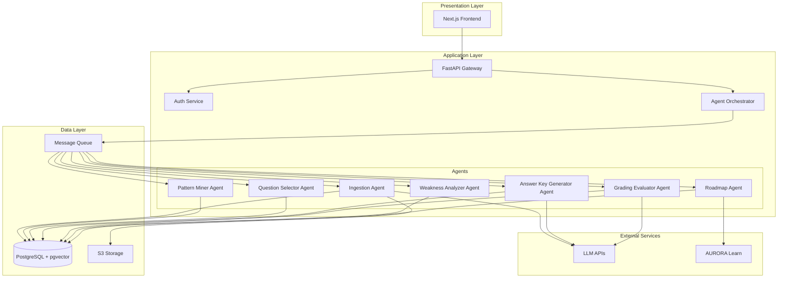

# Design Document: AURORA Assess

## Overview

AURORA Assess is a multi-agent orchestration system that provides intelligent exam generation, automated evaluation, and personalized learning recommendations. The system architecture follows a microservices pattern with specialized agents coordinating through event-driven communication.

The system consists of three main layers:
1. **Presentation Layer**: Next.js 14 frontend with TypeScript, Tailwind CSS, and shadcn/ui components
2. **Application Layer**: FastAPI backend services with agent orchestration
3. **Data Layer**: PostgreSQL with pgvector for relational data and semantic search

Key design principles:
- Agent-based architecture for modularity and scalability
- Event-driven communication for loose coupling
- Knowledge graph for intelligent recommendations
- Hybrid evaluation combining rule-based and LLM-powered grading
- Asynchronous processing for long-running tasks

## Architecture

### System Architecture Diagram



### Component Responsibilities

**Frontend (Next.js 14)**
- User authentication and session management
- Question bank and resource upload interfaces
- Exam configuration and generation UI
- Exam attempt and submission interface
- Performance dashboard and analytics visualization
- Faculty grading review and override interface

**API Gateway (FastAPI)**
- Request routing and validation
- Authentication and authorization middleware
- Rate limiting and request throttling
- Response formatting and error handling
- WebSocket support for real-time updates

**Agent Orchestrator**
- Agent lifecycle management
- Task queue management
- Event publishing and subscription
- Retry logic and error recovery
- Agent monitoring and health checks

**Agents** (detailed in Components section)

**Database (PostgreSQL + pgvector)**
- Relational data storage
- Vector embeddings for semantic search
- Knowledge graph representation
- Transaction management

**Message Queue (Redis/RabbitMQ)**
- Asynchronous task distribution
- Event-driven communication
- Task persistence and reliability

**S3 Storage**
- File storage for question banks and resources
- Versioning and lifecycle management
- Pre-signed URL generation

## Components and Interfaces

### 1. Ingestion & Tagging Agent

**Purpose**: Parse uploaded files, extract questions, and suggest tags using LLM analysis.

**Inputs**:
- File ID and storage path
- Subject ID
- Faculty ID

**Processing**:
1. Retrieve file from S3 storage
2. Parse file based on format (PDF/DOCX/TXT)
3. Extract individual questions using pattern matching and LLM
4. For each question, use LLM to suggest: unit, topic, marks, type, difficulty
5. Store questions with suggested tags in database
6. Generate embeddings for semantic search

**Outputs**:
- List of extracted questions with suggested tags
- Parsing errors and warnings
- Success/failure status

**LLM Prompt Structure**:
```
You are analyzing an exam question to extract metadata.

Question: {question_text}

Extract the following information:
1. Marks: Estimated marks for this question (1, 2, 3, 5, 10, or 12)
2. Type: MCQ, Short Answer, Long Answer, Numerical, or True/False
3. Difficulty: Easy, Medium, or Hard
4. Topic: Main topic covered (be specific)
5. Unit: Broader unit or chapter

Respond in JSON format:
{
  "marks": <number>,
  "type": "<type>",
  "difficulty": "<difficulty>",
  "topic": "<topic>",
  "unit": "<unit>"
}
```

**Interface**:
```python
class IngestionAgent:
    async def process_file(
        self, 
        file_id: str, 
        subject_id: str, 
        faculty_id: str
    ) -> IngestionResult:
        pass
    
    async def suggest_tags(
        self, 
        question_text: str
    ) -> QuestionTags:
        pass
```

### 2. Pattern Miner Agent

**Purpose**: Analyze question banks to learn exam patterns and distributions.

**Inputs**:
- Subject ID
- List of question bank IDs

**Processing**:
1. Retrieve all questions for the subject
2. Calculate mark distribution: count of questions per mark value
3. Calculate type distribution: percentage of each question type
4. Calculate topic coverage: frequency of each topic
5. Calculate difficulty distribution per mark category
6. Aggregate patterns across multiple banks
7. Store learned pattern as JSON

**Outputs**:
- Pattern object with distributions
- Pattern confidence score
- Pattern visualization data

**Pattern Structure**:
```json
{
  "subject_id": "uuid",
  "mark_distribution": {
    "1": 0.15,
    "2": 0.20,
    "3": 0.25,
    "5": 0.20,
    "10": 0.15,
    "12": 0.05
  },
  "type_distribution": {
    "MCQ": 0.30,
    "Short Answer": 0.40,
    "Long Answer": 0.20,
    "Numerical": 0.10
  },
  "topic_weights": {
    "topic_1": 0.25,
    "topic_2": 0.30,
    "topic_3": 0.45
  },
  "difficulty_by_marks": {
    "1": {"Easy": 0.7, "Medium": 0.3},
    "2": {"Easy": 0.5, "Medium": 0.4, "Hard": 0.1},
    "5": {"Medium": 0.6, "Hard": 0.4}
  }
}
```

**Interface**:
```python
class PatternMinerAgent:
    async def learn_patterns(
        self, 
        subject_id: str, 
        bank_ids: List[str]
    ) -> Pattern:
        pass
    
    async def update_pattern(
        self, 
        pattern_id: str, 
        new_bank_id: str
    ) -> Pattern:
        pass
```

### 3. Question Selector Agent

**Purpose**: Select questions for paper generation based on constraints and learned patterns.

**Inputs**:
- Subject ID
- Constraints: total marks, mark distribution, type distribution, topic coverage, difficulty mix
- Number of sets to generate
- Learned pattern

**Processing**:
1. Validate constraints against available questions
2. For each set:
   - Initialize empty paper
   - For each mark category, select questions matching type and difficulty constraints
   - Apply pattern-based weighting for topic selection
   - Ensure minimal overlap with previous sets
   - Use knowledge graph to ensure concept coverage
3. Verify each set satisfies all constraints
4. Return selected question IDs for each set

**Outputs**:
- List of paper sets (each set is a list of question IDs)
- Constraint satisfaction report
- Diversity score across sets

**Selection Algorithm**:
```
1. Build candidate pool: filter questions by subject, marks, type, difficulty
2. For each mark category:
   a. Calculate required count from constraints
   b. Apply topic weights from pattern
   c. Score each candidate: pattern_match * (1 - overlap_penalty) * kg_coverage
   d. Select top N questions
3. Validate total marks and constraint satisfaction
4. If invalid, backtrack and retry with adjusted scoring
```

**Interface**:
```python
class QuestionSelectorAgent:
    async def generate_papers(
        self,
        subject_id: str,
        constraints: PaperConstraints,
        num_sets: int,
        pattern: Pattern
    ) -> List[PaperSet]:
        pass
    
    async def validate_constraints(
        self,
        subject_id: str,
        constraints: PaperConstraints
    ) -> ValidationResult:
        pass
```

### 4. Answer Key Generator Agent

**Purpose**: Generate model answers and grading rubrics for questions.

**Inputs**:
- Question ID
- Question text and type
- Linked resources

**Processing**:
1. For MCQ/True-False: Use stored correct answer
2. For Short/Long Answer:
   - Retrieve linked resources
   - Extract relevant excerpts using semantic search
   - Use LLM to generate model answer grounded in resources
   - Generate grading rubric with point allocation
3. Store answer key with rubric

**Outputs**:
- Model answer text
- Grading rubric (JSON structure)
- Resource citations

**LLM Prompt Structure**:
```
You are generating a model answer for an exam question.

Question: {question_text}
Marks: {marks}
Type: {type}

Relevant Resources:
{resource_excerpts}

Generate:
1. A comprehensive model answer (grounded in the provided resources)
2. A grading rubric breaking down point allocation

Format your response as JSON:
{
  "model_answer": "<detailed answer>",
  "rubric": {
    "criteria": [
      {"description": "<criterion>", "points": <number>},
      ...
    ]
  },
  "citations": ["<resource_id>", ...]
}
```

**Interface**:
```python
class AnswerKeyGeneratorAgent:
    async def generate_answer_key(
        self,
        question_id: str,
        resources: List[Resource]
    ) -> AnswerKey:
        pass
    
    async def generate_rubric(
        self,
        question_text: str,
        marks: int
    ) -> GradingRubric:
        pass
```

### 5. Grading Evaluator Agent

**Purpose**: Evaluate student answers and assign scores with feedback.

**Inputs**:
- Attempt ID
- Student answers
- Answer keys with rubrics

**Processing**:
1. For each question:
   - If MCQ/True-False: exact match comparison
   - If Short/Long Answer:
     - Use LLM to compare student answer with model answer
     - Apply rubric criteria
     - Assign partial credit based on rubric
     - Generate feedback explaining score
2. Calculate total score
3. Store evaluation results

**Outputs**:
- Per-question scores
- Per-question feedback
- Total score
- Evaluation metadata (timestamp, confidence)

**LLM Prompt Structure**:
```
You are grading a student's answer to an exam question.

Question: {question_text}
Marks: {marks}

Model Answer:
{model_answer}

Grading Rubric:
{rubric_json}

Student Answer:
{student_answer}

Evaluate the student's answer against the rubric. For each criterion:
1. Determine if the student met the criterion (fully, partially, or not at all)
2. Assign points accordingly
3. Provide specific feedback

Respond in JSON format:
{
  "criterion_scores": [
    {
      "criterion": "<description>",
      "max_points": <number>,
      "awarded_points": <number>,
      "feedback": "<specific feedback>"
    },
    ...
  ],
  "total_score": <number>,
  "overall_feedback": "<summary feedback>"
}
```

**Interface**:
```python
class GradingEvaluatorAgent:
    async def evaluate_attempt(
        self,
        attempt_id: str,
        answers: List[StudentAnswer],
        answer_keys: List[AnswerKey]
    ) -> Evaluation:
        pass
    
    async def grade_single_answer(
        self,
        student_answer: str,
        answer_key: AnswerKey
    ) -> QuestionEvaluation:
        pass
```

### 6. Weakness Analyzer Agent

**Purpose**: Analyze student performance to identify knowledge gaps and weaknesses.

**Inputs**:
- Student ID
- Evaluation results
- Knowledge graph

**Processing**:
1. Aggregate scores by topic across all attempts
2. Calculate topic-wise performance percentages
3. Identify topics with score < 60% as weaknesses
4. Use knowledge graph to map topics to concepts
5. Calculate concept mastery scores
6. Rank weaknesses by severity (score gap * concept importance)
7. Find related strong concepts (prerequisites)
8. Recommend resources for each weakness

**Outputs**:
- List of weak topics with severity scores
- List of weak concepts with mastery levels
- Recommended resources per weakness
- Performance trends over time

**Analysis Algorithm**:
```
1. For each topic:
   topic_score = sum(question_scores) / sum(question_max_scores)
   
2. Identify weaknesses:
   weaknesses = [topic for topic in topics if topic_score < 0.6]
   
3. Map to concepts using knowledge graph:
   weak_concepts = KG.get_concepts_for_topics(weaknesses)
   
4. Calculate severity:
   severity = (0.6 - topic_score) * concept_importance
   
5. Find prerequisites:
   for concept in weak_concepts:
     prereqs = KG.get_prerequisites(concept)
     strong_prereqs = [p for p in prereqs if mastery[p] > 0.7]
```

**Interface**:
```python
class WeaknessAnalyzerAgent:
    async def analyze_performance(
        self,
        student_id: str,
        evaluation_id: str
    ) -> PerformanceAnalysis:
        pass
    
    async def identify_weaknesses(
        self,
        student_id: str,
        subject_id: str
    ) -> List[Weakness]:
        pass
```

### 7. Roadmap Agent

**Purpose**: Interface with AURORA Learn to update personalized learning roadmaps.

**Inputs**:
- Student ID
- Weaknesses with severity
- Recommended resources

**Processing**:
1. Format weakness data for AURORA Learn API
2. Send POST request to AURORA Learn roadmap endpoint
3. Receive updated roadmap tasks
4. Store roadmap tasks in local database
5. Update concept mastery based on task completion

**Outputs**:
- Roadmap update status
- Updated roadmap tasks
- Sync timestamp

**API Payload Structure**:
```json
{
  "student_id": "uuid",
  "weaknesses": [
    {
      "concept_id": "uuid",
      "mastery_score": 0.35,
      "severity": 0.8,
      "recommended_resources": ["resource_id_1", "resource_id_2"]
    }
  ],
  "timestamp": "2024-01-15T10:30:00Z"
}
```

**Interface**:
```python
class RoadmapAgent:
    async def update_roadmap(
        self,
        student_id: str,
        weaknesses: List[Weakness]
    ) -> RoadmapUpdateResult:
        pass
    
    async def receive_roadmap_tasks(
        self,
        student_id: str,
        tasks: List[RoadmapTask]
    ) -> None:
        pass
    
    async def mark_task_complete(
        self,
        task_id: str,
        student_id: str
    ) -> None:
        pass
```

## Data Models

### Core Entities

```typescript
// User Management
interface User {
  id: string;
  email: string;
  password_hash: string;
  role: 'Student' | 'Faculty' | 'Admin';
  created_at: Date;
  updated_at: Date;
}

// Academic Structure
interface Subject {
  id: string;
  name: string;
  code: string;
  description: string;
}

interface Unit {
  id: string;
  subject_id: string;
  name: string;
  order: number;
}

interface Topic {
  id: string;
  unit_id: string;
  name: string;
  description: string;
}

interface Concept {
  id: string;
  topic_id: string;
  name: string;
  description: string;
  importance: number; // 0-1 scale
}

// Question Bank
interface QuestionBank {
  id: string;
  subject_id: string;
  faculty_id: string;
  file_path: string;
  file_name: string;
  file_size: number;
  upload_date: Date;
  status: 'Uploaded' | 'Processing' | 'Completed' | 'Failed';
}

interface Question {
  id: string;
  bank_id: string;
  text: string;
  marks: number;
  type: 'MCQ' | 'Short Answer' | 'Long Answer' | 'Numerical' | 'True/False';
  difficulty: 'Easy' | 'Medium' | 'Hard';
  unit_id: string;
  topic_id: string;
  correct_answer?: string; // For MCQ/True-False
  embedding: number[]; // Vector for semantic search
  tags_confirmed: boolean;
}

// Resources
interface Resource {
  id: string;
  subject_id: string;
  faculty_id: string;
  title: string;
  file_path: string;
  file_type: string;
  upload_date: Date;
  embedding: number[];
}

interface ResourceTopicLink {
  resource_id: string;
  topic_id: string;
}

interface QuestionResourceLink {
  question_id: string;
  resource_id: string;
  relevance_score: number;
}

// Patterns
interface Pattern {
  id: string;
  subject_id: string;
  mark_distribution: Record<number, number>;
  type_distribution: Record<string, number>;
  topic_weights: Record<string, number>;
  difficulty_by_marks: Record<number, Record<string, number>>;
  confidence: number;
  created_at: Date;
  updated_at: Date;
}

// Papers
interface Paper {
  id: string;
  subject_id: string;
  faculty_id: string;
  title: string;
  total_marks: number;
  generation_date: Date;
  constraints: PaperConstraints;
}

interface PaperConstraints {
  total_marks: number;
  mark_distribution: Record<number, number>; // marks -> count
  type_distribution: Record<string, number>; // type -> count
  topic_coverage: Record<string, number>; // topic_id -> min_questions
  difficulty_mix: Record<string, number>; // difficulty -> percentage
}

interface PaperQuestion {
  paper_id: string;
  question_id: string;
  order: number;
}

// Answer Keys
interface AnswerKey {
  id: string;
  question_id: string;
  model_answer: string;
  rubric: GradingRubric;
  resource_citations: string[];
  created_at: Date;
  reviewed_by_faculty: boolean;
}

interface GradingRubric {
  criteria: RubricCriterion[];
}

interface RubricCriterion {
  description: string;
  points: number;
}

// Attempts and Evaluations
interface Attempt {
  id: string;
  student_id: string;
  paper_id: string;
  start_time: Date;
  submit_time?: Date;
  status: 'In Progress' | 'Submitted' | 'Evaluated';
}

interface StudentAnswer {
  id: string;
  attempt_id: string;
  question_id: string;
  answer_text: string;
  submitted_at: Date;
}

interface Evaluation {
  id: string;
  attempt_id: string;
  total_score: number;
  max_score: number;
  evaluated_at: Date;
  evaluated_by: 'System' | 'Faculty';
}

interface QuestionEvaluation {
  id: string;
  evaluation_id: string;
  question_id: string;
  awarded_score: number;
  max_score: number;
  feedback: string;
  criterion_scores: CriterionScore[];
  overridden: boolean;
  overridden_by?: string;
}

interface CriterionScore {
  criterion: string;
  max_points: number;
  awarded_points: number;
  feedback: string;
}

// Performance Analysis
interface TopicPerformance {
  student_id: string;
  topic_id: string;
  total_score: number;
  max_score: number;
  percentage: number;
  attempt_count: number;
  last_attempt: Date;
}

interface Weakness {
  student_id: string;
  topic_id: string;
  concept_id: string;
  severity: number;
  mastery_score: number;
  recommended_resources: string[];
}

interface ConceptMastery {
  student_id: string;
  concept_id: string;
  mastery_level: number; // 0-1 scale
  last_updated: Date;
}

// Knowledge Graph
interface ConceptPrerequisite {
  concept_id: string;
  prerequisite_id: string;
  strength: number; // 0-1 scale
}

// Roadmap Integration
interface RoadmapUpdate {
  id: string;
  student_id: string;
  weaknesses: Weakness[];
  sent_at: Date;
  acknowledged: boolean;
}

interface RoadmapTask {
  id: string;
  student_id: string;
  concept_id: string;
  title: string;
  description: string;
  resources: string[];
  due_date?: Date;
  completed: boolean;
}

// Agent Tasks
interface AgentTask {
  id: string;
  agent_type: string;
  status: 'Queued' | 'Processing' | 'Completed' | 'Failed';
  input_data: any;
  output_data?: any;
  error_message?: string;
  created_at: Date;
  started_at?: Date;
  completed_at?: Date;
  retry_count: number;
}
```

### Knowledge Graph Structure

The knowledge graph is represented using relational tables with the following structure:

**Nodes**:
- Subject, Unit, Topic, Concept (academic hierarchy)
- Question (linked to topics)
- Resource (linked to topics)
- Student (for mastery tracking)

**Edges**:
- Unit → Subject (belongs_to)
- Topic → Unit (belongs_to)
- Concept → Topic (belongs_to)
- Concept → Concept (prerequisite)
- Question → Topic (covers)
- Question → Resource (references)
- Resource → Topic (explains)
- Student → Concept (mastery_level)

**Key Queries**:

1. Find all questions covering a concept:
```sql
SELECT q.* FROM questions q
JOIN topics t ON q.topic_id = t.id
JOIN concepts c ON c.topic_id = t.id
WHERE c.id = ?
```

2. Find prerequisites for a concept:
```sql
SELECT c2.* FROM concepts c1
JOIN concept_prerequisites cp ON c1.id = cp.concept_id
JOIN concepts c2 ON cp.prerequisite_id = c2.id
WHERE c1.id = ?
ORDER BY cp.strength DESC
```

3. Find weak concepts with strong prerequisites:
```sql
SELECT c.*, cm.mastery_level,
       (SELECT AVG(cm2.mastery_level) 
        FROM concept_prerequisites cp
        JOIN concept_mastery cm2 ON cp.prerequisite_id = cm2.concept_id
        WHERE cp.concept_id = c.id AND cm2.student_id = ?) as avg_prereq_mastery
FROM concepts c
JOIN concept_mastery cm ON c.id = cm.concept_id
WHERE cm.student_id = ? AND cm.mastery_level < 0.6
HAVING avg_prereq_mastery > 0.7
```

## Correctness Properties


A property is a characteristic or behavior that should hold true across all valid executions of a system—essentially, a formal statement about what the system should do. Properties serve as the bridge between human-readable specifications and machine-verifiable correctness guarantees.

### Property 1: Role-Based Access Control Enforcement

*For any* protected endpoint and any user, access should be granted if and only if the user's role has the required permissions for that endpoint.

**Validates: Requirements 1.6**

### Property 2: Unauthorized Access Returns 403

*For any* user without required permissions attempting to access a protected resource, the system should return a 403 Forbidden error.

**Validates: Requirements 1.7**

### Property 3: Valid File Format Acceptance

*For any* file in PDF, DOCX, or TXT format uploaded by Faculty, the system should accept the file for processing.

**Validates: Requirements 2.1**

### Property 4: Question Extraction from Valid Files

*For any* valid question bank file, parsing should extract at least one question with text content.

**Validates: Requirements 2.3**

### Property 5: Parse Error Reporting

*For any* file that fails parsing, the system should return an error message describing the failure reason.

**Validates: Requirements 2.4**

### Property 6: File Storage Round-Trip

*For any* uploaded file, storing it in S3 and then retrieving it by its unique identifier should return the identical file content (verified by checksum).

**Validates: Requirements 2.5, 16.6**

### Property 7: Question Bank Association Integrity

*For any* uploaded question bank, the stored record should correctly associate it with the uploading Faculty user ID and specified subject ID.

**Validates: Requirements 2.6**

### Property 8: Question Metadata Extraction

*For any* extracted question, the system should produce metadata including marks (numeric value) and type (one of the valid types).

**Validates: Requirements 2.7**

### Property 9: Resource Format Acceptance

*For any* file in PDF, DOCX, PPTX, or TXT format uploaded as a resource by Faculty, the system should accept the file.

**Validates: Requirements 3.1**

### Property 10: Resource Storage with Metadata

*For any* uploaded resource, the stored record should include all metadata fields (title, subject, unit, topic) and the file should be retrievable from S3.

**Validates: Requirements 3.2**

### Property 11: Embedding Generation for Resources

*For any* uploaded resource, the system should generate a vector embedding and store it in the database.

**Validates: Requirements 3.3, 17.1**

### Property 12: Resource-Topic Linking

*For any* valid resource ID and topic ID, creating a link should result in the link being retrievable from the database.

**Validates: Requirements 3.4**

### Property 13: Resource Deletion Referential Integrity

*For any* resource deletion, all references to that resource (in question_resource_links, resource_topic_links) should be removed or marked as deleted.

**Validates: Requirements 3.5**

### Property 14: Student Resource Access Control

*For any* student and resource, the student should be able to access the resource if and only if they are enrolled in the resource's subject.

**Validates: Requirements 3.6**

### Property 15: LLM Tag Suggestion Generation

*For any* question text, the system should generate tag suggestions including all required fields (unit, topic, marks, type, difficulty).

**Validates: Requirements 4.2**

### Property 16: Question Tag Storage Round-Trip

*For any* question with confirmed tags, storing the tags and then retrieving the question should return the same tag values.

**Validates: Requirements 4.6**

### Property 17: Bulk Tagging Equivalence

*For any* set of questions and tag values, applying tags via bulk operation should produce the same result as applying tags individually to each question.

**Validates: Requirements 4.7**

### Property 18: Mark Distribution Validity

*For any* question bank, the computed mark distribution should have frequencies that sum to 1.0 (or counts that sum to total question count).

**Validates: Requirements 5.1**

### Property 19: Type Distribution Validity

*For any* question bank, the computed type distribution percentages should sum to 1.0.

**Validates: Requirements 5.2**

### Property 20: Topic Weight Validity

*For any* question bank, the computed topic weights should sum to 1.0.

**Validates: Requirements 5.3**

### Property 21: Difficulty Distribution Validity

*For any* question bank and mark category, the difficulty distribution should have percentages that sum to 1.0.

**Validates: Requirements 5.4**

### Property 22: Pattern Storage Round-Trip

*For any* learned pattern, storing it in the database and then retrieving it by pattern ID should return an equivalent pattern object.

**Validates: Requirements 5.5**

### Property 23: Pattern Aggregation Commutativity

*For any* set of question banks for a subject, aggregating patterns in different orders should produce equivalent final patterns (within numerical tolerance).

**Validates: Requirements 5.6**

### Property 24: Constraint Validation Correctness

*For any* set of paper generation constraints and available questions, validation should return satisfiable if and only if sufficient questions exist to meet all constraints.

**Validates: Requirements 6.2, 18.2, 18.3, 18.4, 18.5**

### Property 25: Generated Paper Constraint Satisfaction

*For any* generated paper, all specified constraints (total marks, mark distribution, type distribution, topic coverage, difficulty mix) should be satisfied.

**Validates: Requirements 6.3, 19.6**

### Property 26: Paper Set Question Diversity

*For any* set of N generated papers, the average pairwise question overlap should be below a threshold (e.g., 20%).

**Validates: Requirements 6.4, 19.2**

### Property 27: Generation Output Completeness

*For any* successful paper generation request for N sets, the output should include exactly N paper IDs and N preview links.

**Validates: Requirements 6.6**

### Property 28: Constraint Violation Error Reporting

*For any* unsatisfiable constraint set, the error response should identify at least one specific constraint that cannot be satisfied.

**Validates: Requirements 6.7, 18.6**

### Property 29: Answer Key Completeness

*For any* generated paper with M questions, exactly M answer keys should be created.

**Validates: Requirements 7.1**

### Property 30: MCQ Answer Key Correctness

*For any* MCQ or True/False question, the generated answer key should match the stored correct_answer field.

**Validates: Requirements 7.2**

### Property 31: LLM Answer Generation

*For any* Short Answer or Long Answer question, the system should generate a model answer using LLM.

**Validates: Requirements 7.3**

### Property 32: Resource-Grounded Answer Generation

*For any* question with linked resources, the LLM-generated answer should include citations to at least one of those resources.

**Validates: Requirements 7.4**

### Property 33: Rubric Point Allocation

*For any* answer key with a grading rubric, the sum of points across all rubric criteria should equal the question's total marks.

**Validates: Requirements 7.5**

### Property 34: Answer Key Access Control

*For any* student who has not submitted an attempt for a paper, the student should not be able to access answer keys for that paper.

**Validates: Requirements 7.7, 8.7**

### Property 35: Attempt Save and Resume Round-Trip

*For any* in-progress attempt that is saved, resuming the attempt should restore all previously entered answers exactly.

**Validates: Requirements 8.4**

### Property 36: Submission Validation

*For any* attempt submission, validation should fail if and only if at least one required question is unanswered.

**Validates: Requirements 8.5**

### Property 37: Submission Association Integrity

*For any* submitted attempt, the stored record should correctly associate all answers with the student ID and paper ID.

**Validates: Requirements 8.6**

### Property 38: Evaluation Trigger

*For any* submitted attempt, an evaluation task should be created and queued within a reasonable time (e.g., 1 second).

**Validates: Requirements 9.1**

### Property 39: MCQ Grading Determinism

*For any* MCQ or True/False answer, grading should assign full marks if the answer exactly matches the correct answer, and zero marks otherwise.

**Validates: Requirements 9.2**

### Property 40: LLM Grading Execution

*For any* Short Answer or Long Answer question, the system should invoke LLM-based evaluation to produce a score and feedback.

**Validates: Requirements 9.3**

### Property 41: Correct Answer Key Usage

*For any* question evaluation, the system should use the answer key associated with that specific question.

**Validates: Requirements 9.4**

### Property 42: Score Bounds Enforcement

*For any* question evaluation, the awarded score should be between 0 and the question's maximum marks (inclusive).

**Validates: Requirements 9.5**

### Property 43: Feedback Generation

*For any* evaluated question, the evaluation should include non-empty feedback text.

**Validates: Requirements 9.6**

### Property 44: Evaluation Storage

*For any* completed evaluation, the results should be stored in the database and retrievable by evaluation ID.

**Validates: Requirements 9.7**

### Property 45: Topic Performance Computation

*For any* evaluation, topic-wise performance scores should be computed as (sum of scores for topic questions) / (sum of max scores for topic questions).

**Validates: Requirements 10.1**

### Property 46: Weakness Identification Threshold

*For any* topic with performance score below 60%, the topic should be identified as a weakness.

**Validates: Requirements 10.2**

### Property 47: Performance Aggregation Correctness

*For any* student and subject, aggregating performance across multiple attempts should correctly compute average scores per topic.

**Validates: Requirements 10.3**

### Property 48: Concept Mastery Computation

*For any* student and concept, the mastery score should be computed from the performance scores of all topics linked to that concept.

**Validates: Requirements 10.4**

### Property 49: Weakness Ranking Consistency

*For any* set of weaknesses, ranking by severity should order them such that higher severity weaknesses appear first.

**Validates: Requirements 10.5**

### Property 50: Resource Recommendation Generation

*For any* identified weakness, the system should recommend at least one resource linked to the weak topic.

**Validates: Requirements 10.7**

### Property 51: Knowledge Graph Concept Query

*For any* concept ID, querying for questions covering that concept should return all questions whose topics are linked to that concept.

**Validates: Requirements 11.5**

### Property 52: Knowledge Graph Prerequisite Query

*For any* concept ID, querying for prerequisites should return all concepts that have a prerequisite edge pointing to the given concept.

**Validates: Requirements 11.6**

### Property 53: Weak Concept with Strong Prerequisites Query

*For any* student, querying for weak concepts with strong prerequisites should return concepts where mastery < 0.6 and average prerequisite mastery > 0.7.

**Validates: Requirements 11.7**

### Property 54: Roadmap Update Generation

*For any* completed weakness analysis, a roadmap update request should be generated.

**Validates: Requirements 12.1**

### Property 55: Roadmap Update Format Completeness

*For any* roadmap update, the payload should include concept IDs, mastery scores, and recommended resources for all weaknesses.

**Validates: Requirements 12.3**

### Property 56: Roadmap Sync Status Update

*For any* roadmap update that receives an acknowledgment from AURORA Learn, the sync status should be marked as complete.

**Validates: Requirements 12.4**

### Property 57: Task Completion Mastery Update

*For any* completed roadmap task, the associated concept's mastery score should be increased.

**Validates: Requirements 12.7**

### Property 58: Score Override Recalculation

*For any* faculty score override, the total attempt score should be recalculated as the sum of all question scores (including overridden scores).

**Validates: Requirements 13.4**

### Property 59: Override Logging

*For any* grading override, a log entry should be created with faculty ID, timestamp, question ID, old score, and new score.

**Validates: Requirements 13.5**

### Property 60: Override Notification

*For any* evaluation modification by faculty, a notification should be sent to the student.

**Validates: Requirements 13.6**

### Property 61: Agent Task Event Publishing

*For any* agent task that completes successfully, an event should be published to the message queue.

**Validates: Requirements 14.2**

### Property 62: Exponential Backoff Retry

*For any* failed agent task, retry delays should follow exponential backoff (e.g., 1s, 2s, 4s, 8s, ...).

**Validates: Requirements 14.4**

### Property 63: Agent Activity Logging

*For any* agent task execution, a log entry should be created with timestamp, agent type, input data, and output data.

**Validates: Requirements 14.5**

### Property 64: Agent Failure Alert

*For any* agent that fails more than N times (e.g., 5) consecutively, an alert should be sent to administrators.

**Validates: Requirements 14.7**

### Property 65: API Request Logging

*For any* API request, a log entry should be created with timestamp, user ID, endpoint, and response status.

**Validates: Requirements 15.1**

### Property 66: Agent Execution Logging

*For any* agent execution, a log entry should be created with input parameters, output results, and execution time.

**Validates: Requirements 15.2**

### Property 67: LLM Call Logging

*For any* LLM API call, a log entry should be created with prompt, response, token count, and latency.

**Validates: Requirements 15.3**

### Property 68: Structured Log Format

*For any* log entry, the format should be valid JSON parseable by standard JSON parsers.

**Validates: Requirements 15.4**

### Property 69: Metrics Computation Correctness

*For any* time window, computed metrics (request rate, error rate, etc.) should match the counts from actual log entries.

**Validates: Requirements 15.6**

### Property 70: File Upload Unique Identifier

*For any* uploaded file, a unique identifier should be generated and no two files should have the same identifier.

**Validates: Requirements 16.2**

### Property 71: Pre-Signed URL Generation

*For any* file access request, a pre-signed URL should be generated with expiration time set to 1 hour from generation.

**Validates: Requirements 16.3**

### Property 72: File Versioning

*For any* question bank file update, a new version should be created and the previous version should remain accessible.

**Validates: Requirements 16.4**

### Property 73: Soft Deletion Retention

*For any* file deletion, the file should remain accessible for 30 days before permanent deletion.

**Validates: Requirements 16.5**

### Property 74: File Access Authorization

*For any* file access attempt, access should be granted if and only if the user has authorization for that file.

**Validates: Requirements 16.7**

### Property 75: Search Query Embedding Generation

*For any* search query string, the system should generate query embeddings.

**Validates: Requirements 17.3**

### Property 76: Search Result Limit

*For any* search query, the system should return at most 10 results.

**Validates: Requirements 17.4**

### Property 77: Search Result Ranking

*For any* search query, results should be ranked such that higher-ranked results have higher combined similarity and metadata relevance scores.

**Validates: Requirements 17.5**

### Property 78: Search Result Subject Filtering

*For any* student search query, all returned results should be resources from subjects the student is enrolled in.

**Validates: Requirements 17.6**

### Property 79: Real-Time Constraint Validation

*For any* constraint input change, validation should execute and return results within a reasonable time (e.g., 500ms).

**Validates: Requirements 18.1**

### Property 80: Constraint Adjustment Feasibility

*For any* invalid constraint set, suggested adjustments should result in a satisfiable constraint set.

**Validates: Requirements 18.7**

### Property 81: Async Generation Job ID

*For any* paper generation request, a job ID should be returned immediately (within 1 second) before generation completes.

**Validates: Requirements 19.3**

### Property 82: Job Status Polling

*For any* valid job ID, polling for status should return the current status (Queued, Processing, Completed, or Failed).

**Validates: Requirements 19.4**

### Property 83: Generation Completion Notification

*For any* completed paper generation, an email notification should be sent to the requesting faculty member.

**Validates: Requirements 19.5**

### Property 84: Generation Summary Report Completeness

*For any* paper generation producing N sets, the summary report should include constraint satisfaction data for all N sets.

**Validates: Requirements 19.7**

### Property 85: Dashboard Data Filtering

*For any* filter criteria (subject, date range), the filtered dashboard data should include only records matching all filter criteria.

**Validates: Requirements 20.7**

## Error Handling

### Error Categories

1. **Validation Errors** (400 Bad Request)
   - Invalid input format
   - Missing required fields
   - Constraint violations
   - File format not supported

2. **Authentication Errors** (401 Unauthorized)
   - Invalid credentials
   - Expired session token
   - Missing authentication token

3. **Authorization Errors** (403 Forbidden)
   - Insufficient permissions for action
   - Access to unauthorized resource

4. **Not Found Errors** (404 Not Found)
   - Resource does not exist
   - Invalid ID reference

5. **Conflict Errors** (409 Conflict)
   - Duplicate resource creation
   - Concurrent modification conflict

6. **Processing Errors** (500 Internal Server Error)
   - File parsing failure
   - LLM API failure
   - Database connection failure
   - Agent execution failure

7. **Service Unavailable Errors** (503 Service Unavailable)
   - External service (AURORA Learn, LLM API) unavailable
   - System overload

### Error Response Format

All errors should follow a consistent JSON structure:

```json
{
  "error": {
    "code": "ERROR_CODE",
    "message": "Human-readable error message",
    "details": {
      "field": "specific_field",
      "reason": "detailed reason"
    },
    "timestamp": "2024-01-15T10:30:00Z",
    "request_id": "uuid"
  }
}
```

### Error Recovery Strategies

**File Parsing Failures**:
- Log detailed error with file ID and parsing stage
- Return descriptive error to user
- Suggest manual question entry or format correction
- Retain original file for manual review

**LLM API Failures**:
- Implement exponential backoff retry (3 attempts)
- Fall back to simpler prompts if token limit exceeded
- Queue for manual review if all retries fail
- Log all LLM interactions for debugging

**Database Failures**:
- Implement connection pooling with retry logic
- Use transactions for multi-step operations
- Rollback on failure to maintain consistency
- Alert administrators for persistent failures

**Agent Failures**:
- Retry with exponential backoff (up to 5 attempts)
- Move to dead letter queue after max retries
- Alert administrators for manual intervention
- Provide UI for faculty to retry failed operations

**Constraint Satisfaction Failures**:
- Return specific constraint violations
- Suggest feasible adjustments
- Allow faculty to relax constraints
- Provide constraint validation before generation

## Testing Strategy

### Dual Testing Approach

The system requires both unit testing and property-based testing for comprehensive coverage:

**Unit Tests**: Verify specific examples, edge cases, and error conditions
- Specific user registration and role assignment scenarios
- Edge cases like file size limits (50MB boundary)
- Error handling for invalid inputs
- Integration points between components
- Specific LLM prompt-response pairs

**Property Tests**: Verify universal properties across all inputs
- All 85 correctness properties defined above
- Each property test should run minimum 100 iterations
- Use property-based testing library (e.g., Hypothesis for Python, fast-check for TypeScript)
- Tag each test with: **Feature: aurora-assess, Property N: [property description]**

### Property-Based Testing Configuration

**Library Selection**:
- Python backend: Use Hypothesis
- TypeScript frontend: Use fast-check

**Test Configuration**:
```python
# Python example with Hypothesis
from hypothesis import given, settings
import hypothesis.strategies as st

@settings(max_examples=100)
@given(
    user_role=st.sampled_from(['Student', 'Faculty', 'Admin']),
    endpoint=st.sampled_from(['/api/papers', '/api/admin/users', '/api/resources'])
)
def test_property_1_rbac_enforcement(user_role, endpoint):
    """
    Feature: aurora-assess, Property 1: Role-Based Access Control Enforcement
    
    For any protected endpoint and any user, access should be granted 
    if and only if the user's role has the required permissions.
    """
    # Test implementation
    pass
```

**Test Organization**:
- Group property tests by requirement area
- One test file per agent or major component
- Separate unit tests from property tests
- Use descriptive test names referencing property numbers

### Testing Phases

**Phase 1: Unit Testing Foundation**
- Test core CRUD operations
- Test authentication and authorization
- Test file upload and storage
- Test database models and queries

**Phase 2: Property Testing Core Logic**
- Test constraint validation properties (Properties 24, 25, 26)
- Test paper generation properties
- Test grading properties (Properties 39, 40, 41, 42)
- Test knowledge graph query properties (Properties 51, 52, 53)

**Phase 3: Integration and End-to-End Testing**
- Test complete workflows (upload → parse → generate → evaluate)
- Test agent orchestration and event handling
- Test AURORA Learn integration
- Test error recovery and retry logic

**Phase 4: Performance and Load Testing**
- Test system under concurrent user load
- Test LLM API rate limiting and queuing
- Test database query performance
- Test file storage and retrieval at scale

### Test Data Generation

**Generators for Property Tests**:
- User generator: random roles, IDs, permissions
- Question generator: random text, marks, types, difficulties
- Constraint generator: random but internally consistent constraints
- Answer generator: random text of varying lengths and quality
- File generator: random valid/invalid file formats and sizes

**Fixtures for Unit Tests**:
- Sample question banks with known patterns
- Sample resources with known content
- Sample papers with known constraint satisfaction
- Sample student answers with known expected scores

### Continuous Testing

- Run unit tests on every commit
- Run property tests on every pull request
- Run integration tests nightly
- Run performance tests weekly
- Monitor test coverage (target: 80%+ for critical paths)

## API Endpoints

### Authentication

```
POST /api/auth/register
POST /api/auth/login
POST /api/auth/logout
GET /api/auth/me
```

### Question Banks

```
POST /api/question-banks/upload
GET /api/question-banks
GET /api/question-banks/:id
DELETE /api/question-banks/:id
POST /api/question-banks/:id/analyze
GET /api/question-banks/:id/questions
PUT /api/questions/:id/tags
POST /api/questions/bulk-tag
```

### Resources

```
POST /api/resources/upload
GET /api/resources
GET /api/resources/:id
DELETE /api/resources/:id
POST /api/resources/:id/link-topic
GET /api/resources/search
```

### Patterns

```
GET /api/patterns/subject/:subjectId
POST /api/patterns/learn
PUT /api/patterns/:id
```

### Papers

```
POST /api/papers/validate-constraints
POST /api/papers/generate
GET /api/papers/generation-status/:jobId
GET /api/papers
GET /api/papers/:id
GET /api/papers/:id/questions
```

### Answer Keys

```
POST /api/answer-keys/generate
GET /api/answer-keys/question/:questionId
PUT /api/answer-keys/:id
```

### Attempts

```
POST /api/attempts/start
PUT /api/attempts/:id/save
POST /api/attempts/:id/submit
GET /api/attempts/:id
POST /api/attempts/:id/answers
```

### Evaluations

```
GET /api/evaluations/attempt/:attemptId
PUT /api/evaluations/:id/override
GET /api/evaluations/:id/history
```

### Performance

```
GET /api/performance/student/:studentId
GET /api/performance/student/:studentId/weaknesses
GET /api/performance/student/:studentId/dashboard
```

### Roadmap

```
POST /api/roadmap/update
GET /api/roadmap/student/:studentId/tasks
PUT /api/roadmap/tasks/:id/complete
POST /api/roadmap/webhook (from AURORA Learn)
```

### Admin

```
GET /api/admin/users
PUT /api/admin/users/:id/role
GET /api/admin/agents/status
GET /api/admin/logs
GET /api/admin/metrics
```

## Implementation Phases

### Phase 1: Foundation (Weeks 1-4)

**Goals**: Establish core infrastructure and basic CRUD operations

**Tasks**:
1. Set up project structure (Next.js frontend, FastAPI backend)
2. Configure PostgreSQL with pgvector extension
3. Implement authentication and authorization
4. Create database schema and migrations
5. Implement user management (register, login, roles)
6. Set up S3-compatible storage integration
7. Implement basic file upload and storage
8. Create basic UI components (layout, navigation, forms)
9. Set up logging and monitoring infrastructure
10. Write unit tests for core functionality

**Deliverables**:
- Working authentication system
- Basic CRUD for users, subjects, units, topics
- File upload and storage working
- Basic UI with navigation

### Phase 2: Intelligence (Weeks 5-10)

**Goals**: Implement agents, LLM integration, and core business logic

**Tasks**:
1. Set up message queue (Redis/RabbitMQ)
2. Implement Agent Orchestrator
3. Implement Ingestion Agent with LLM tagging
4. Implement Pattern Miner Agent
5. Implement Question Selector Agent with constraint validation
6. Implement Answer Key Generator Agent with LLM
7. Implement Grading Evaluator Agent with hybrid grading
8. Implement Weakness Analyzer Agent
9. Implement Roadmap Agent with AURORA Learn integration
10. Build knowledge graph structure and queries
11. Implement paper generation workflow
12. Implement exam attempt and submission workflow
13. Implement evaluation workflow
14. Write property tests for core properties (Properties 1-50)
15. Write unit tests for agents

**Deliverables**:
- All 7 agents implemented and tested
- Paper generation working end-to-end
- Evaluation working with LLM grading
- Knowledge graph queries working
- Integration with AURORA Learn

### Phase 3: Polish (Weeks 11-14)

**Goals**: Complete UI, advanced features, comprehensive testing

**Tasks**:
1. Build faculty dashboard for question bank management
2. Build faculty interface for paper generation with constraint UI
3. Build student exam interface with save/resume
4. Build student performance dashboard with visualizations
5. Build faculty grading review and override interface
6. Implement semantic search for resources
7. Implement real-time constraint validation
8. Implement async paper generation with job status
9. Implement email notifications
10. Add comprehensive error handling and user feedback
11. Optimize database queries and add indexes
12. Implement caching for frequently accessed data
13. Write remaining property tests (Properties 51-85)
14. Write integration tests for complete workflows
15. Perform load testing and optimization
16. Write user documentation
17. Deploy to staging environment
18. Conduct user acceptance testing
19. Fix bugs and polish UI/UX
20. Deploy to production

**Deliverables**:
- Complete, polished UI for all user roles
- All features implemented and tested
- Performance optimized
- Documentation complete
- System deployed and ready for use

## Technology Stack Details

### Frontend
- **Framework**: Next.js 14 with App Router
- **Language**: TypeScript
- **Styling**: Tailwind CSS
- **Components**: shadcn/ui
- **State Management**: Zustand for global state
- **Data Fetching**: TanStack Query (React Query)
- **Forms**: React Hook Form with Zod validation
- **Charts**: Recharts for performance visualizations
- **File Upload**: react-dropzone

### Backend
- **Framework**: FastAPI (Python 3.11+)
- **Language**: Python
- **ORM**: SQLAlchemy
- **Migrations**: Alembic
- **Validation**: Pydantic
- **Async**: asyncio with async/await
- **Message Queue**: Redis with aioredis
- **Task Queue**: Celery (optional, for background tasks)

### Database
- **Primary**: PostgreSQL 15+
- **Vector Extension**: pgvector for embeddings
- **Connection Pooling**: asyncpg

### Storage
- **Object Storage**: MinIO (S3-compatible) or AWS S3
- **File Processing**: PyPDF2, python-docx for parsing

### LLM Integration
- **Primary**: OpenAI API (GPT-4)
- **Fallback**: Anthropic Claude or Google Gemini
- **Embeddings**: OpenAI text-embedding-3-small

### Infrastructure
- **Containerization**: Docker and Docker Compose
- **Reverse Proxy**: Nginx
- **Logging**: Structured logging with Python logging module
- **Monitoring**: Prometheus + Grafana (optional)
- **CI/CD**: GitHub Actions

### Testing
- **Python**: pytest, Hypothesis (property-based testing)
- **TypeScript**: Vitest, fast-check (property-based testing)
- **E2E**: Playwright
- **Load Testing**: Locust

## Security Considerations

1. **Authentication**: Use bcrypt for password hashing, JWT for session tokens
2. **Authorization**: Implement middleware for role-based access control
3. **File Upload**: Validate file types, scan for malware, limit file sizes
4. **SQL Injection**: Use parameterized queries via ORM
5. **XSS**: Sanitize user inputs, use Content Security Policy
6. **CSRF**: Implement CSRF tokens for state-changing operations
7. **Rate Limiting**: Implement rate limiting on API endpoints
8. **Data Privacy**: Encrypt sensitive data at rest, use HTTPS for all communication
9. **LLM Security**: Sanitize prompts, validate LLM responses, implement content filtering
10. **Audit Logging**: Log all sensitive operations with user ID and timestamp
